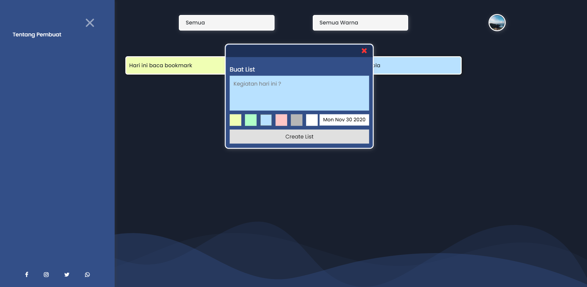

## To Do List

### Apa dan Tujuan

Sebelumnya, saya pernah membuat program To Do List sederhana yang saya bagikan juga disini [Simple To Do List](https://github.com/Azrilardian/Simple-To-Do-List), dan ini merupakan pengembangan lebih lanjut dari project tersebut.

To Do List ini saya buat dengan tujuan untuk mengasah logika pemrograman saya, dalam hal ini spesifik pada bahasa pemrograman Javascript.

### Teknloogi yang digunakan

-   Html
-   Css
-   Javascaript
-   Webpack

### Fitur

-   CRUD ( _**C**eate_, _**R**ead_, _**U**pdate_, _**D**elete_ )
-   Memilih warna list
-   Filter list berdasarkan status ( belum / sudah selesai )
-   Filter list berdasarkan warna

### Catatan

_Project_ ini merupakan versi **3.0**, silahkan cek ke riwayat _commit_ untuk melihat _project_ versi sebelumnya.

### Screenshot

Versi sebelumnya

Versi terbaru
